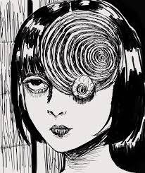

# IDEA9103_CreativeCodingProject
This file explains the approach to the individual task, the technical aspects, experience guide, inspirations and intent behind the final artowrk.

## Introduction
For our group task, we chose The Scream by Edvard Munch. The painting’s raw emotional intensity and its iconic, distorted landscape immediately stood out to us as the perfect work to reinterpret through code. Its swirling sky, vibrating colours, and sense of psychological tension made it an exciting challenge: how could we translate that same emotional weight into something interactive, animated, and digital? We were especially curious to see how we could use generative techniques to transform the original into a new visual experience.

## The technique I picked
For my individual approach, I chose a **time-based animation**, using timers, triggers, and controlled events. I was curious about how movement could evoke the emotional atmosphere of the painting — whether motion could capture the same unease, tension, and surreal quality that Munch created through brushstrokes. By designing the animation to unfold over time, I aimed to guide the viewer through shifting emotional states, rather than presenting everything all at once.

## Idea for the individual task
My concept was inspired by the feelings the painting evokes: the sense of internal noise, the dreamlike distortion of the world, and the way everything feels like it’s collapsing inward before spiralling out of control. The painting has always reminded me of that moment when reality blurs with emotion — when the external world mirrors the chaos inside your mind. I wanted to express that experience through gradual transitions, instability, and finally a spiralling motion that reflects an inner psychological collapse.

## My approach
I began by dividing the image into key regions — foreground figure, sky, and background —so that each area could be animated independently. This allowed me to give every section its own behaviour and emotional tone. After segmenting the painting, I layered the regions like a digital collage, giving me full control over how and when each component would move or transform.

## Technical Aspects
Technically, the animation uses a combination of **classes, nested functions, timers, and transformations** to control the behaviour of each visual layer. I used translate(), controlled frame-based distortions, and custom timing sequences to choreograph the progression of the animation.
The prototype is fully responsive, adapting to changes in window size so the composition maintains its intended proportions across different viewports.

## The experience
The animation unfolds over time in distinct phases:

- 1–3 seconds: The painting appears in a pixelated, fractured state.
- 3–5 seconds: The full image is revealed as the distortion fades.
- 5–10 seconds: The background begins to shift in slow, undulating waves, introducing instability and panick.
- 10+ seconds: Finally, the human begins to spiral out of control, creating an intense focal point.

Each stage builds upon the previous one, moving from clarity to distortion to complete psychological unraveling.

## Symbolism
For the wavy, shifting background, I wanted to express a feeling of instability, panic, and surreal disorientation — as if the world itself is vibrating with anxiety. The gentle waves eventually intensify, reflecting the loss of grounding that the painting communicates so powerfully.

When the guy begins to spiral, the movement creates a repeated, echoing pattern that almost resembles a distorted mirror. This was intentional. The spiral becomes a visual metaphor for confronting your own reflection during a moment of emotional overwhelm.

While playing around with the graphics, I noticed that the pattern also reminded me of Junji Ito’s Uzumaki, where spirals represent psychological descent and one’s inner turmoil. 

Using the figure itself to generate the pattern felt symbolic: the person becomes both the cause and the victim of their spiralling thoughts, echoing the idea of voices in the head folding inward.

## References

## AI acknowledgment
I have used AI to polish the language used in this readme file.