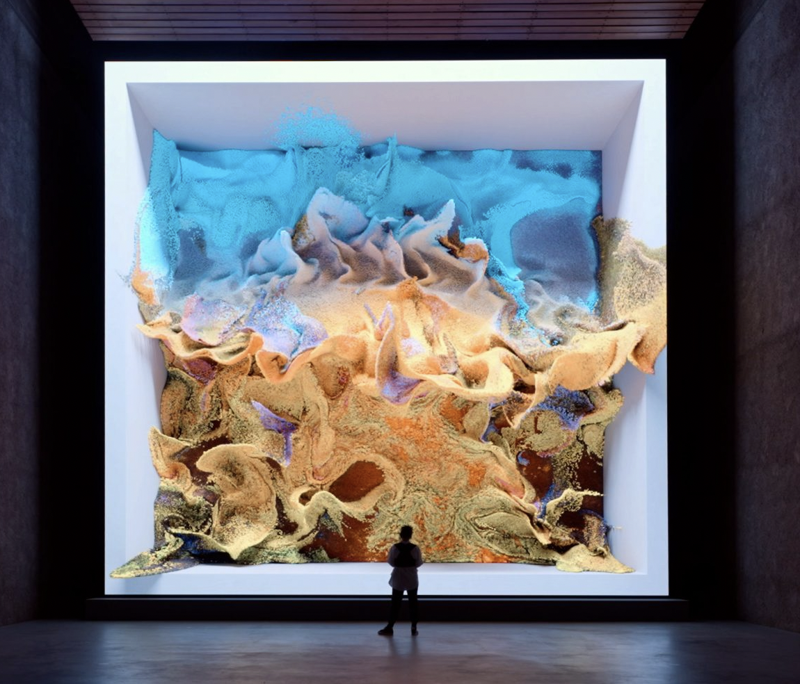
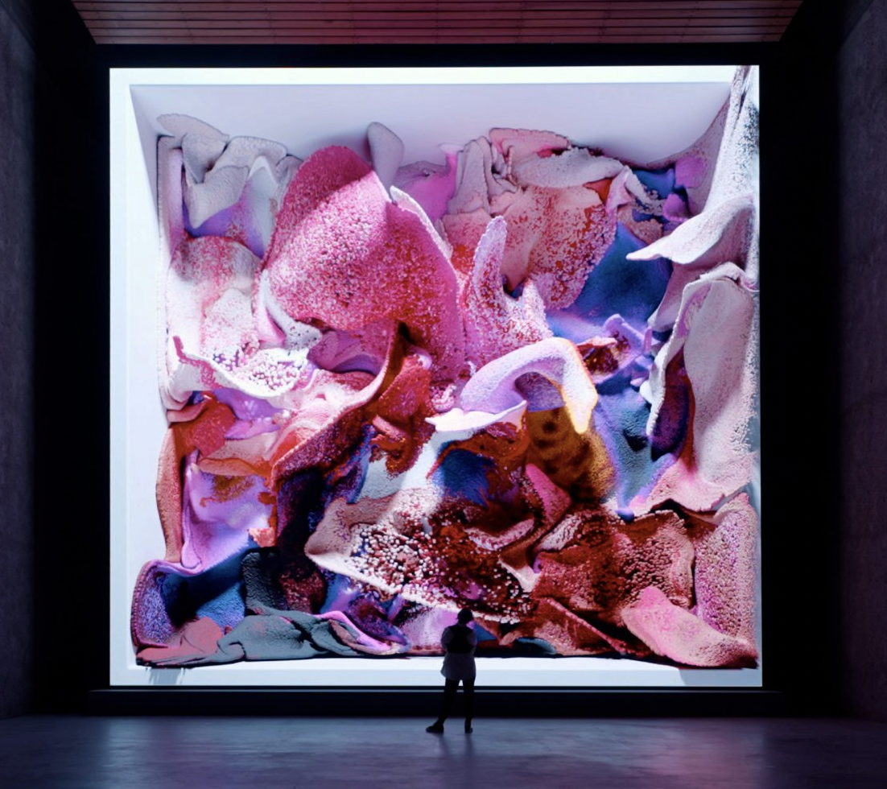

# IDEA9103_CreativeCodingProject

# Instructions

Load the page to see the animation start immediately and automatically. Move and scroll mouse down to reveal entire image. Click on the page if you want to lock in the full image. Move mouse horizontally to see more glitch and vertically for more wave. 

# Details of your individual approach 

I used Perlin noise for my individual coding part. My focus was wave distortion of the entire background image combined with particle-like jittering of the "guy" in the foreground, emphasizing fluid, natural distortion. Rather than using it as 5 different layers, I've used the original artwork as one layer and then the "guy" layer on top of that. The background painting is distorted and the foreground "guy" image moves smoothly with noise-based calculations in both X and Y, adding random jitters.

# References 

Similarly from Quiz 8, I was inspired by Refik Anadol's Machine Hallucinations series. This is a visual style characterised by fluid, constantly morphing, abstract forms and colours that seem to drift and shift like a liquid dream. It appears as a dynamic, continuous flow of visual information. The Perlin Noise is used to create that wavy motion. 

The code draws heavily from: https://thecodingtrain.com/challenges/24-perlin-noise-flow-field and https://www.youtube.com/watch?v=1-QXuR-XX_s

# Technical explanation

 The code loops through each row pixel line to distort by horizontal offsets derived from Perlin noise. It adds smooth wave distortion and dynamic interaction affected by mouse X-position and noise input varied by mouseX. The noise() function returns random numbers that can be tuned to feel organic. I found this from the p5.js reference website: https://p5js.org/reference/#/p5/noise. This is extremely relevant as it generates the Perlin values. Other functions that we haven't covered in the Perlin Noise lecture are map() which re-maps a number from one range to another. The "speed" and "magnitude" are re-mapped values controlling animation speed and distortion magnitude using mouse position for interaction. "revealHeight" controls how much of the painting's vertical range to animate/distort, either the full height or according to mouseY if not locked. These were used in order to have a growing Perlin noise distortion effect that evolves smoothly, and retains the original painting's structure while transforming it dynamically over time.

The foreground guy image position is controlled using sine waves jittery movement. The random() function add unpredictability and irregular bursts, providing natural "twitches." The code achieves this by looping over every row of pixels in screamImg and using copy() to shift the pixel rows horizontally according to Perlin noise.

## Changes to group code

I've made a lot of changes to the group code and have pretty much made my  Instead of the different 5 layers that we had in the group code, I chose to use the original artwork as the background. The group made the effects of the background slowly appear using dot art. Mine is more distorted and glitchy. Instead of revealing using the dot art, mine shows the effects straight away. 

